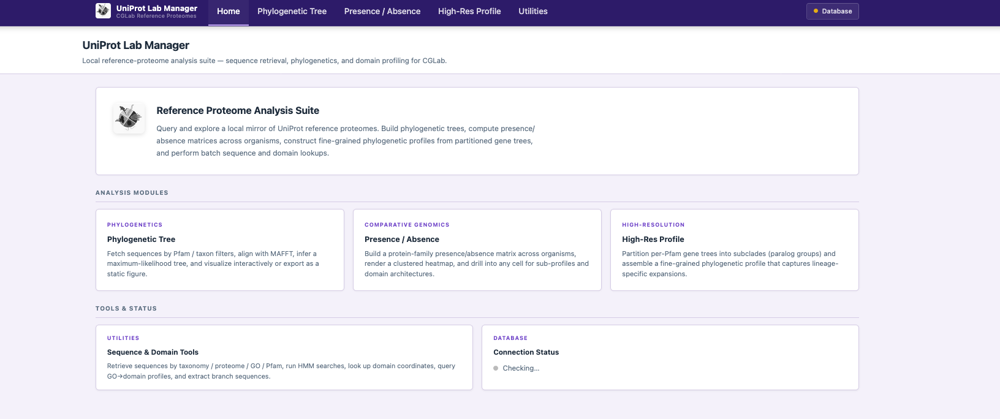
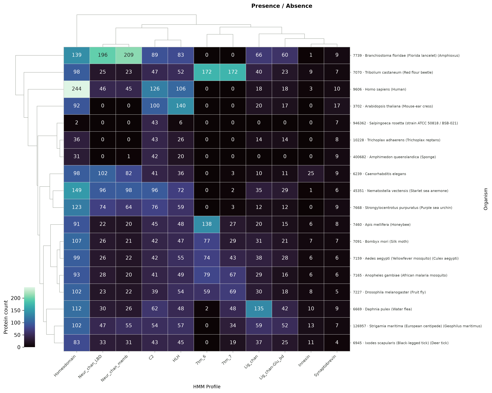
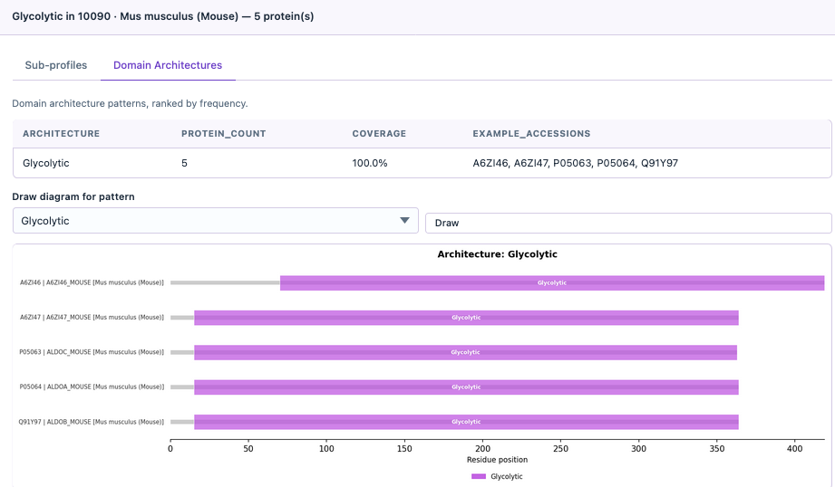
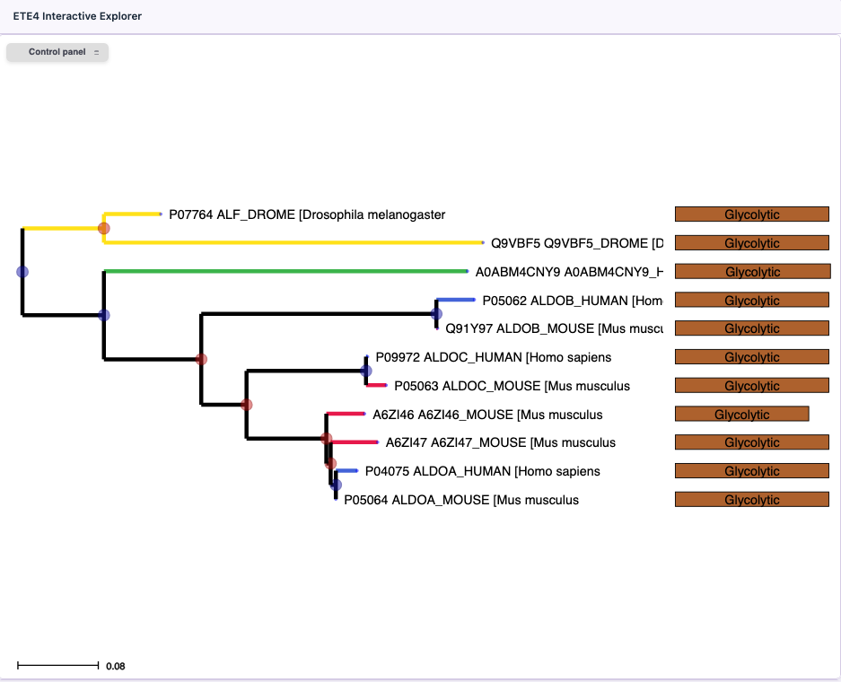
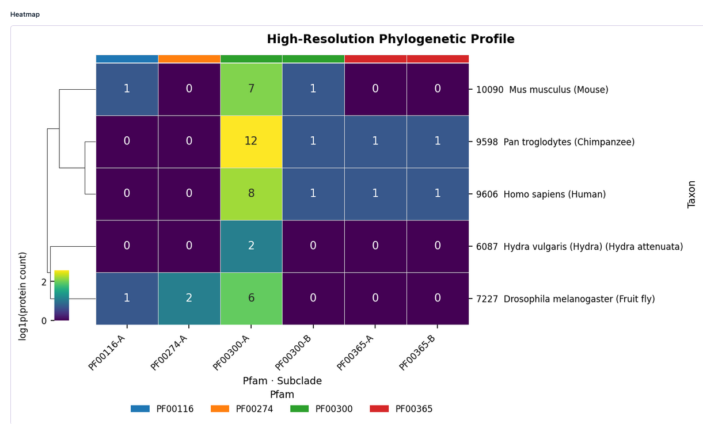
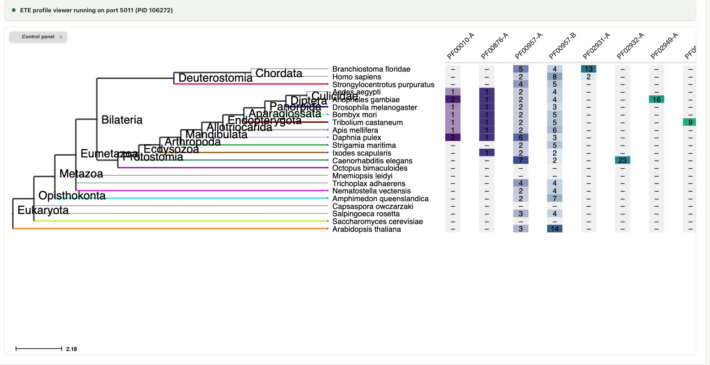
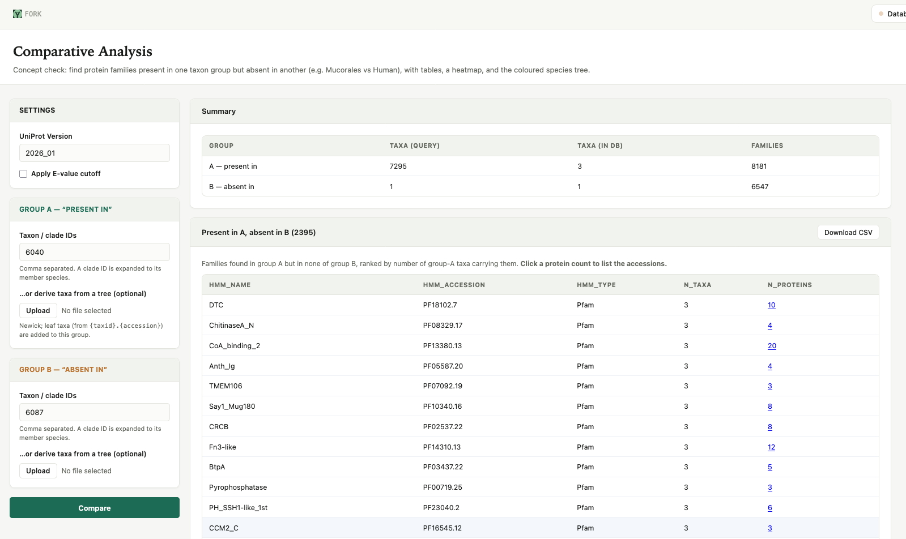
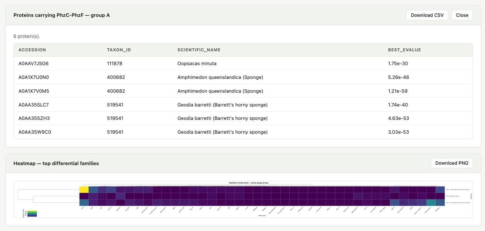
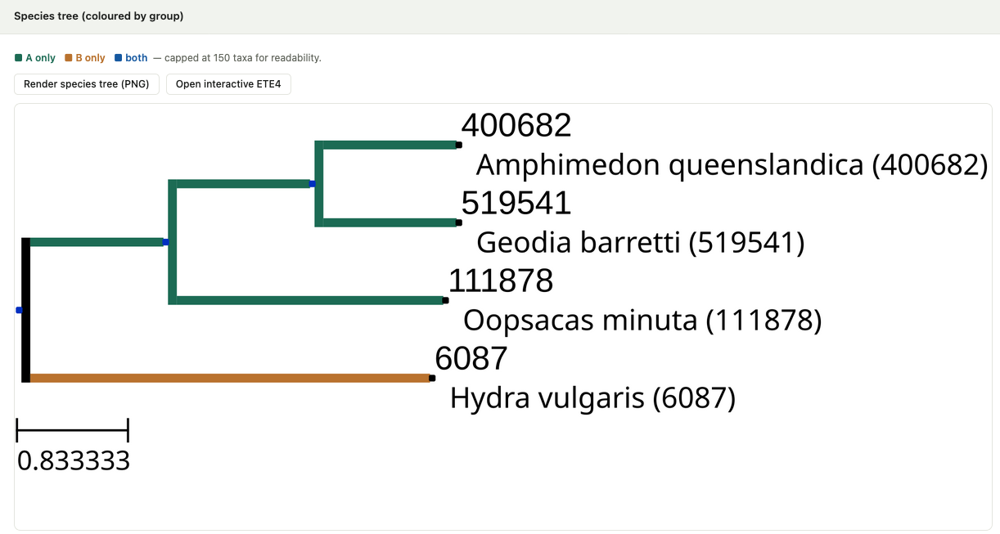
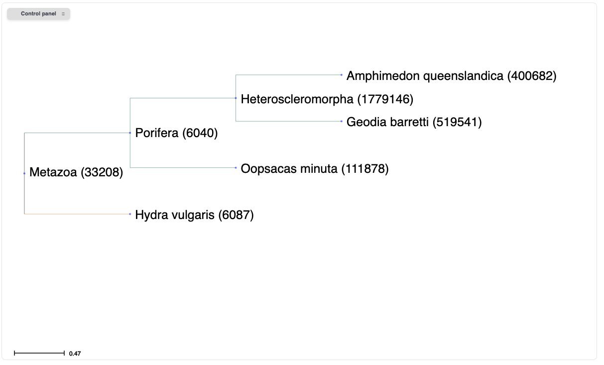

# FORK

A Flask web app for querying, visualizing, and comparing proteins across a **local UniProt Reference Proteomes database** enriched with Pfam-A HMM search results. Built at CGLab — no internet needed for queries once the database is set up.



---

## What it does

Four main analysis modules, plus sequence/domain utilities:

| Module | What you get |
|--------|-------------|
| **Phylogenetic Tree** | Fetch sequences by Pfam/taxon → align (MAFFT) → tree (FastTree/IQ-TREE) → interactive D3 viewer or ETE4 explorer with domain shapes; download the tree as plain Newick |
| **Presence / Absence** | Taxa × Pfam profile heatmap; drill into any cell for sub-profiles or domain architecture breakdown |
| **High-Res Profile** | Partition gene trees into subclade (paralog) groups — by depth, manual MRCA, node path, or automatic duplication — and profile each subclade separately across taxa; optionally combine the DB Pfams with an uploaded FASTA |
| **Comparative Analysis** | "Concept check": find protein families present in one taxon group but absent in another (e.g. Mucorales vs Human) — tables (present-in-A-not-B, the reverse, shared), a heatmap, a group-coloured species tree, and protein-accession drill-down |
| **Utilities** | Standard retrieval, HMM search, accession lookup, domain coordinates, GO→domain profiles, branch extraction |

---

## Quickstart

### 1. Build the database

This tool requires a local MySQL database. Build it first with the companion repo:
→ https://github.com/athenamarou/Ref_Proteomes_Local_DB

Run in order:
1. `uniprot_sync_v7.py` — builds the database
2. `pyhmmer_hmmsearch.py` — populates HMM search results

### 2. Install dependencies

```bash
conda env create -f FORK.yml
conda activate bio_tools
```

### 3. Configure database connection

Create a `.env` file:

```
DB_HOST=localhost
DB_USER=your_db_user
DB_PASSWORD=your_password
DB_NAME=uniprot_db_cglab
```

Or fill in the **Database** panel (top bar) at runtime.

### 4. Run

```bash
bash run_webapp.sh
# or directly:
python app.py
```

Open `http://localhost:8080` (if 8080 is taken the app picks the next free port and prints the URL).

---

## Toy example

### GUI — Presence/Absence workflow

Query a few metabolic Pfam profiles across 5 model organisms, get a clustered heatmap, then drill into any cell to see domain architectures:

**Step 1** — enter taxon IDs (`9606, 10090, 9598, 7227, 6087`) and Pfam names (`Glycolytic, His_Phos_1, COX2, PFK`) in the Presence/Absence tab → clustered heatmap:



**Step 2** — click any cell (e.g. *Glycolytic* × Mouse) → domain architecture breakdown:



---

### CLI — build a phylogenetic tree

```bash
python tree_from_db.py \
  --pfam Glycolytic \
  --version 2026_01 \
  --prefix /tmp/glycolytic_tree \
  --taxids 9606,10090,7227 \
  --aln mafft \
  --ml fasttree \
  --no_ncbi \
  --no_explore
```

Outputs: `.fa`, `.mft`, `.mft.gt01`, `.nwk`, `.itol_colors.txt`, `.itol_domains.txt`

To open the interactive ETE4 viewer (with domain shapes and node popups):

```bash
python tree_from_db.py \
  --pfam Glycolytic \
  --version 2026_01 \
  --prefix /tmp/glycolytic_tree \
  --taxids 9606,10090,7227 \
  --aln mafft \
  --ml fasttree
```



---

### Python API — fetch sequences programmatically

```python
from get_reference_uniprot_set_lib import fetch_sequences, fetch_sequences_by_hmm_hit

# Fetch all human + mouse proteins
records = fetch_sequences("2026_01", taxon_ids=[9606, 10090])

# Fetch proteins with a Glycolytic domain hit
records = fetch_sequences_by_hmm_hit("2026_01", "Glycolytic", taxon_ids=[9606, 10090, 7227])

for r in records:
    print(r.id, len(r.seq))
```

Returns BioPython `SeqRecord` objects, ready for downstream analysis or writing to FASTA.

---

### High-resolution profile

Split the Glycolytic gene tree into subclade groups (paralogs A/B/C…) and profile each separately:



Columns are `Pfam·Subclade` pairs; the color stripe groups subclades by parent Pfam. Export as CSV or PNG.

You can also **combine the DB Pfams with an uploaded FASTA** (headers `{taxid}.{accession}`) — it is built into its own gene tree and joins the same profile. In the node list, **click a row to add its node path** instead of typing it; in the ETE4 tree preview, **right-click a branch → "Use branch for profiling"** to send it straight to the Node-path list. Any built gene tree can be **downloaded as a plain Newick file**.

Four ways to define the subclades:

| Mode | How subclades are chosen |
|------|--------------------------|
| **Depth slider** | Cut the tree at a chosen root-to-node distance; every branch crossing that depth starts a subclade |
| **Manual MRCA** | Pick groups of leaves; each group's most recent common ancestor becomes one subclade |
| **Node path** | Name internal nodes explicitly by their child-index path from the root |
| **Auto duplication** | Give a taxonomic group (NCBI taxid, e.g. 33213 = Bilateria); nodes where the same species appears on both sides of a split — a duplication signature — become the split points |

Auto duplication works best for families with a handful of ancient paralog groups. For large superfamilies (thousands of leaves) the outermost duplication sits near the root and yields only a coarse 2-way split — use the depth slider there instead.

Species tree with Phylogenetic Profile each taxon for the subclades of interest.




---

### Comparative analysis ("concept check")

Ask which protein families are present in one taxon group but absent in another — e.g. *families in **Mucorales** (`4827`) but not in **Human** (`9606`)*. Give each group a taxon or clade ID (a clade is expanded to its member species via NCBI taxonomy), and/or derive a group's taxa from an uploaded tree.

The report gives you:

- **Present in A, absent in B**, the **reverse**, and **shared** — family tables (name, accession, type, taxa count, protein count), each downloadable as CSV.
  

- **Protein drill-down** — click a family's protein count to list the actual accessions (accession · taxon · organism · best e-value).
- **Heatmap** of the top differential families across the group-A taxa (capped at 60 taxa for readability).
  
  
- **Species tree coloured by group** — static PNG *and* the interactive ETE4 explorer (green = A only, amber = B only, blue = both; capped at 150 taxa).
  
  


---

## Repository structure

```
FORK/
├── app.py                            # Entry point — Flask app
├── run_webapp.sh                     # Convenience launcher
├── templates/                        # HTML templates (Jinja2)
│   ├── base.html
│   ├── index.html
│   ├── about.html
│   ├── tree.html
│   ├── presence.html
│   ├── highres.html
│   ├── profiling.html                # Combined Presence/Absence + High-Res page
│   ├── compare.html                  # Comparative "concept check" page
│   └── utilities.html
├── static/                           # CSS / JS assets
│   └── ete4_overrides/contextmenu.js # Repo-served ETE4 right-click menu override
├── get_reference_uniprot_set_lib.py  # Backend retrieval library (importable)
├── tree_from_db.py                   # CLI: fetch → align → tree → viewer
├── subclade_partition.py             # Partition gene trees into subclades
├── tree_builder.py                   # Per-Pfam tree orchestration + caching
├── ete_profile.py                    # ETE4 viewer — presence/absence on NCBI tree
├── ete_highres_profile.py            # ETE4 viewer — high-res profile on NCBI tree
├── ete_species_tree.py               # ETE4 viewer — comparison species tree (by group)
├── viz_utils.py                      # Heatmap, domain diagram, tree rendering
├── utils.py                          # Shared helpers
├── figures/                          # Screenshots for README
└── setup/                            # One-time DB build scripts (admin only)
    ├── uniprot_sync_v7.py
    └── pyhmmer_hmmsearch.py
```

---

## Requirements

```
flask, pandas, matplotlib, seaborn, biopython,
mysql-connector-python, python-dotenv, ete4>=4.4.0, numpy
```

All managed via `FORK.yml`.

---

## Notes

- Output files (`.fa`, `.mft`, `.nwk`, `.itol_*.txt`) are written to the path given by `--prefix` and excluded from version control via `.gitignore`.
- The `.env` file contains credentials — never commit it.
- As an alternative for visualizing trees, load the `.nwk` + `.itol_colors.txt` + `.itol_domains.txt` files into [iTOL](https://itol.embl.de).
- ETE4 interactive viewer starts a local server on the first free port in the range 5001–5050 (auto-selected, so multiple trees can be opened at once). The D3 viewer has no server dependency.
- The **Comparative** tab, the species-tree renders, and **auto-duplication** partitioning use ETE4's NCBI taxonomy database (`taxa.sqlite`). It downloads on first use, or build it once with `python -c "from ete4 import NCBITaxa; NCBITaxa().update_taxonomy_database()"`.
- High-res profiling caches trees by build parameters; rerunning with the same settings reuses the cache.

**[Full API reference & CLI guide](API_REFERENCE.md)**
